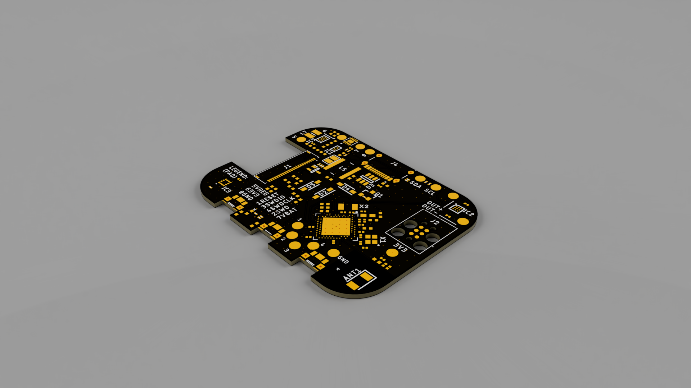
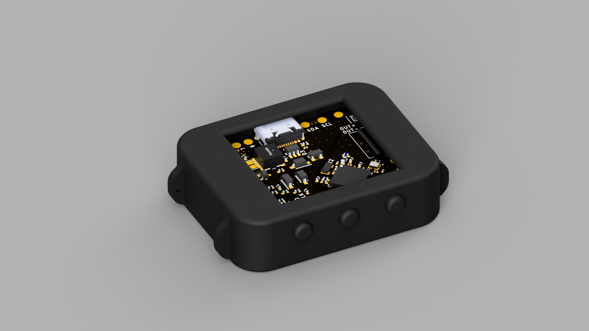
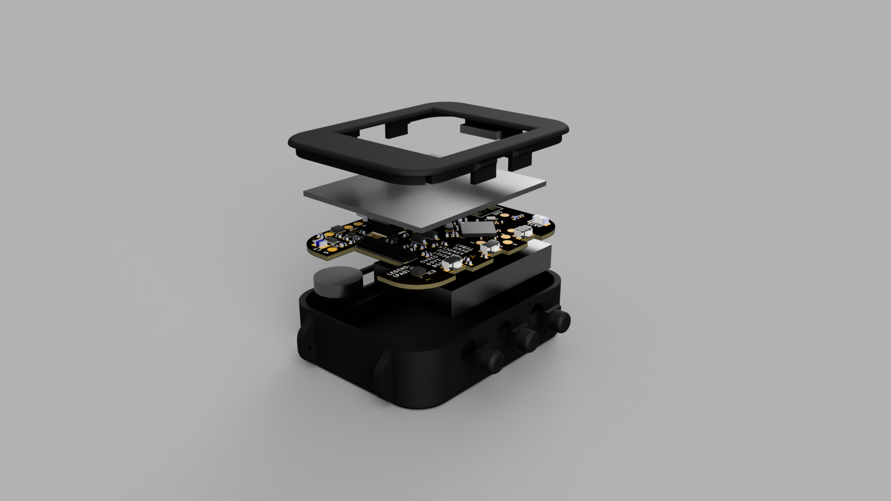

# InkTime

Author: Luca Mazilescu

## Block Diagram

  

## Hardware Functionality

### Microcontroller

The system is built around a Nordic **nRF52840** SoC (Arm Cortex-M4F @ 64 MHz, 1 MB flash, 256 kB RAM). It was chosen because it integrates a 2.4 GHz radio supporting Bluetooth Low Energy alongside a USB 2.0 full-speed controller, which covers both the wireless sync path and the USB-C data path without any external transceiver. The MCU runs from a 32 MHz high-frequency crystal (XC1/XC2) for the radio and CPU, and a 32.768 kHz low-frequency crystal (XL1/XL2) for the RTC and low-power sleep timing — accurate timekeeping is the whole point of a watch, so the LFXO is not optional.

An on-board 2.4 GHz chip antenna (2450AT18B100E) is placed at the edge of the PCB with a keep-out area underneath, fed from the `ANT` pin through a matching network.

### Display — E-Paper (SPI)

A reflective e-paper display is driven over **SPI** using SCK (P0.02), MOSI (P0.03) and a dedicated chip-select (P0.05). Three auxiliary GPIOs handle the panel-specific control lines: `EPD_DC` (P0.15) switches between command and data bytes, `EPD_RST` (P0.16) resets the display controller, and `EPD_BUSY` (P0.17) is an input the MCU polls while the panel completes a refresh. The display connects through a 24-pin FPC.

Because e-paper draws current only during a refresh (and essentially zero while displaying a static image), the entire display rail is gated by a PFET whose gate is driven from P1.01. Firmware can therefore cut power to the panel completely between updates, which is the dominant reason this watch can be expected to last days on a charge rather than hours.

### IMU — BMA421 (I²C)

A Bosch **BMA421** 3-axis accelerometer sits on the shared I²C bus. It provides raw acceleration data plus on-chip step counting functionality. Two interrupt lines, `IMU_INT1` (P0.08) and `IMU_INT2` (P1.08), let the sensor wake the MCU from deep sleep when a gesture or step event occurs, so the CPU does not have to poll the bus continuously.

### Haptics — DRV2605 (I²C)

A TI **DRV2605L** haptic driver actuates a coin LRA/ERM motor for notifications and UI feedback. It is configured over I²C and can play back effects from its internal ROM library, so the MCU only issues short "play effect N" commands rather than streaming waveforms. An enable line (`HAPTIC_EN`, P0.12) lets the MCU fully power the driver down when idle.

### Power management — BQ25180 + MAX17048 + RT6160

USB-C provides 5 V in through a USBLC6-2SC6Y ESD protector, with the two required 5.1 kΩ CC pull-downs advertising the device as a sink. A **BQ25180** single-cell Li-ion charger manages the LiPo battery: it handles CC/CV charging from USB, switches between USB and battery as the system source, and reports faults over I²C and on the `PMIC_INT` line (P0.11).

The system rail is generated by an **RT6160** buck-boost regulator producing a stable `3V3` across the full battery voltage range (~3.0–4.2 V), which is important because a plain buck would drop out near end-of-discharge and a plain boost would waste efficiency when the cell is full.

State-of-charge is tracked by a **MAX17048** fuel gauge directly on the battery node. It uses Maxim's ModelGauge algorithm, so no external current-sense resistor is needed — the MCU just reads the remaining percentage and cell voltage over I²C, and an `ALERT` line (P1.10) fires on programmable under/over-voltage thresholds.

### Inputs — Buttons

Three user buttons are connected to P0.13, P0.14 and P1.02 as active-low inputs with RC debounce. They use the MCU's internal pull-ups and can trigger GPIOTE interrupts to wake the device from System OFF.

### Shared I²C bus

All four I²C peripherals (BMA421, MAX17048, DRV2605L, BQ25180) share a single bus on SDA (P0.06) and SCL (P0.07), with 3.3 kΩ pull-ups to `3V3`. The devices have distinct 7-bit addresses, so one TWI instance on the nRF52840 is sufficient. Running I²C at 400 kHz (Fast-mode) is more than enough headroom for the low-bandwidth status reads these sensors require.

### Debug

An SWD interface (`SWDCLK`, `SWDIO`, optional `SWO` on P1.00) is exposed through a Tag-Connect TC2030 footprint, which avoids placing a bulky 2×5 header on a wearable-sized PCB.

### Expected capabilities

With the hardware described above, firmware would be able to: keep accurate time from the LFXO-backed RTC, render watch faces and menus on the e-paper display, detect steps and wrist-raise via the BMA421, deliver haptic notifications, communicate with a phone over BLE, enumerate as a USB device for charging and data, and report battery percentage and charger state in real time.

## Pinout Table

| Pin | Signal | Direction | Peripheral | Description |
|-----|--------|-----------|------------|-------------|
| P0.02 | SPI_SCK | Output | E-Paper Display | SPI clock |
| P0.03 | SPI_MOSI | Output | E-Paper Display | SPI data out |
| P0.05 | EPD_CS | Output | E-Paper Display | Chip select |
| P0.06 | SDA | Bidir | Fuel Gauge, Charger, IMU, Haptics | Shared I2C data |
| P0.07 | SCL | Output | Fuel Gauge, Charger, IMU, Haptics | Shared I2C clock |
| P0.08 | IMU_INT1 | Input | IMU (BMA421) | Interrupt line 1 |
| P0.11 | PMIC_INT | Input | Charger (BQ25180) | Fault/status interrupt |
| P0.12 | HAPTIC_EN | Output | Haptics (DRV2605) | Driver enable |
| P0.13 | — | Input | Button 1 | User button |
| P0.14 | — | Input | Button 2 | User button |
| P0.15 | EPD_DC | Output | E-Paper Display | Data/command select |
| P0.16 | EPD_RST | Output | E-Paper Display | Display reset |
| P0.17 | EPD_BUSY | Input | E-Paper Display | Busy status |
| P0.18 | RESET | Input | — | System reset |
| P1.00 | SWO | Output | Debug (pad) | SWD trace output |
| P1.01 | — | Output | EPD power gate | EPD power control |
| P1.02 | — | Input | Button 3 | User button |
| P1.08 | IMU_INT2 | Input | IMU (BMA421) | Interrupt line 2 |
| P1.10 | ALERT | Input | Fuel Gauge (MAX17048) | UV/OV alert |
| D+ | D+ | Bidir | USB-C connector | USB data+ |
| D− | D- | Bidir | USB-C connector | USB data− |
| XL1/XL2 | — | — | 32.768 kHz crystal | Low-frequency clock |
| XC1/XC2 | — | — | 32 MHz crystal | High-frequency clock |
| SWDCLK | SWDCLK | Input | Debug (pad) | SWD clock |
| SWDIO | SWDIO | Bidir | Debug (pad) | SWD data |
| ANT | RF | Output | 2.4 GHz antenna | Wireless antenna feed |

## Bill of Materials

The full, JLCPCB validated table can be found in `Assets/JLCPCB_BOM.xlsx`. That version contains detailed information about each part, such as the associated schematic designators, descriptions, and more.

| Part Name |Qty|Link (Order + Datasheet)|
| :-- | :--: | :--: |
|BMA421|1|[Link](https://jlcpcb.com/partdetail/BoschSensortec-BMA421/C5242966)|
|0201X104K100NT|5|[Link](https://jlcpcb.com/partdetail/270391-0201X104K100NT/C284966)|
|CGA0402X5R475M250GT|1|[Link](https://jlcpcb.com/partdetail/HRE-CGA0402X5R475M250GT/C6119795)|
|KH-TYPE-C-16P|1|[Link](https://jlcpcb.com/partdetail/Shenzhen_KinghelmElec-KH_TYPE_C16P/C709357)|
|RT6160AWSC|1|[Link](https://jlcpcb.com/partdetail/RichtekTech-RT6160AWSC/C7065276)|
|SDFL1608S100KTF|1|[Link](https://jlcpcb.com/partdetail/Sunlord-SDFL1608S100KTF/C1035)|
|0201WMF220KTEE|1|[Link](https://jlcpcb.com/partdetail/479910-0201WMF220KTEE/C473517)|
|EVPAKE31A|3|[Link](https://jlcpcb.com/partdetail/PANASONIC-EVPAKE31A/C569760)|
|GRM033R61A104KE15D|5|[Link](https://jlcpcb.com/partdetail/MurataElectronics-GRM033R61A104KE15D/C76934)|
|5034802400|1|[Link](https://jlcpcb.com/partdetail/MOLEX-5034802400/C122434)|
|CM8V-T1A-32.768KHZ-9PF-20PPM-TB-QA|1|[Link](https://jlcpcb.com/partdetail/C5366546)|
|BQ25180YBGR|1|[Link](https://jlcpcb.com/partdetail/TexasInstruments-BQ25180YBGR/C3682423)|
|DRV2605YZFR|1|[Link](https://jlcpcb.com/partdetail/TexasInstruments-DRV2605YZFR/C81079)|
|2450AT18B100E|1|[Link](https://jlcpcb.com/partdetail/JohansonDielectrics-2450AT18B100E/C2917717)|
|SI1308EDL-T1-GE3|1|[Link](https://jlcpcb.com/partdetail/VishayIntertech-SI1308EDL_T1GE3/C469327)|
|GRM155R60J226ME11D|2|[Link](https://jlcpcb.com/partdetail/408393-GRM155R60J226ME11D/C415703)|
|GRM155R61H105KE05D|9|[Link](https://jlcpcb.com/partdetail/1609005-GRM155R61H105KE05D/C1518208)|
|SDCL1005C15NJTDF|1|[Link](https://jlcpcb.com/partdetail/Sunlord-SDCL1005C15NJTDF/C27143)|
|0201WMJ0000TEE|3|[Link](https://jlcpcb.com/partdetail/259867-0201WMJ0000TEE/C270337)|
|CC0201KRX5R7BB473|1|[Link](https://jlcpcb.com/partdetail/YAGEO-CC0201KRX5R7BB473/C505465)|
|CL05A475MP5NRNC|5|[Link](https://jlcpcb.com/partdetail/24469-CL05A475MP5NRNC/C23733)|
|CL05A105KA5NQNC|6|[Link](https://jlcpcb.com/partdetail/53938-CL05A105KA5NQNC/C52923)|
|SDCL1005C3N9STDF|1|[Link](https://jlcpcb.com/partdetail/Sunlord-SDCL1005C3N9STDF/C14033)|
|CR0201FH5101G|2|[Link](https://jlcpcb.com/partdetail/LIZElec-CR0201FH5101G/C100142)|
|GRM0335C1H1R0BA01D|2|[Link](https://jlcpcb.com/partdetail/MurataElectronics-GRM0335C1H1R0BA01D/C85893)|
|CL05A106MQ5NUNC|3|[Link](https://jlcpcb.com/partdetail/16204-CL05A106MQ5NUNC/C15525)|
|0201CG120J500NT|4|[Link](https://jlcpcb.com/partdetail/51400-0201CG120J500NT/C50391)|
|BQ25180YBGR|1|[Link](https://jlcpcb.com/partdetail/TexasInstruments-BQ25180YBGR/C3682423)|
|MAX17048G+T10|1|[Link](https://jlcpcb.com/partdetail/2777647-MAX17048GT10/C2682616)|
|NX2016SA-32MHZ-STD-CZS-5|1|[Link](https://jlcpcb.com/partdetail/NDK-NX2016SA_32MHZ_STD_CZS5/C843260)|
|0201WMJ0332TEE|2|[Link](https://jlcpcb.com/partdetail/259848-0201WMJ0332TEE/C270318)|
|MBR0530|3|[Link](https://jlcpcb.com/partdetail/78464-MBR0530/C77336)|
|FTC252012SR47MBCA|1|[Link](https://jlcpcb.com/partdetail/6763488-FTC252012SR47MBCA/C5832368)|
|DMG2305UX-7|1|[Link](https://jlcpcb.com/partdetail/DiodesIncorporated-DMG2305UX7/C150470)|
|USBLC6-2SC6Y|1|[Link](https://jlcpcb.com/partdetail/TECHPUBLIC-USBLC62SC6Y/C5310974)|
|UCR006YVPFLR470|1|[Link](https://jlcpcb.com/partdetail/ROHMSemicon-UCR006YVPFLR470/C2089071)|
|CPF0201D10KC1|6|[Link](https://jlcpcb.com/partdetail/TEConnectivity-CPF0201D10KC1/C4187156)|
|744043680|1|[Link](https://jlcpcb.com/partdetail/WurthElektronik-744043680/C2045671)|
|GRM0335C1H101JA01D|1|[Link](https://jlcpcb.com/partdetail/MurataElectronics-GRM0335C1H101JA01D/C76922)|
|NRF52840-QIAA-R7|1|[Link](https://jlcpcb.com/partdetail/NordicSemicon-NRF52840_QIAAR7/C1851953)|

## Renders

## Design Details

### Schematic and Components

The reference schematic was double-checked with information from each component's datasheet.
Mismatches were flagged and investigated, usually stemming from older versions of the reference circuits being used by the reference schematic.

### PCB Layout and Routing

Manufacturing parameters were kept within the ranges recommended by JLCPCB's standard rigid PCB assembly service.

A top ground pour was stitched to the ground plane, and more granular manual stitching was performed around the antenna feed line.

Teardrops were generated at most trace joints, and angles were carefully considered during routing.
Since Fusion exhibits buggy behavior when generating teardrops for off-grid rotations,
the shapes were manually smoothed for traces in close proximity to the MCU,
since it's placed at 45 degrees.

Due to space constraints and the minimum recommended text height being 1mm,
the silkscreen uses an indexed legend to allow labeling in narrow areas.
ICs, pads, and any larger components have labels on the silkscreen.

In order to achieve mechanical robustness, internal annular rings were kept large.
To accomodate, some unused pins of the MCU's package were masked, thus electrically isolating them from any traces running below.

VIA-in-pad (ViP) was liberally used for the smaller SMD multi-pin components.
DRC errors stemming from ViP-related clearance were manually approved.

Spatial constraints like the antenna's keep out zone, crystal oscillator trace length,
and IMU-shaker distance maximization were carefully considered. Decoupling capacitors were also placed in close proximity to the relevant pins.

USB (D+, D-) lines were differentially routed, keeping lengths approximately equal, and the lines close together.

### 3D Design

Detailed models of every component were retreived and integrated into the 3D PCB model.

The full closed-case assembly was checked for mechanical interference.
A potential problem was found regarding the maximum height of the battery listed in its datasheet,
as the case's bottom cavity doesn't provide enough clearance below the PCB.
This may or may not be a problem in practice, the case was left as-is to be tested in a prototype.
